# Container Management Automation Architecture

## Overview

This document describes the architecture for the automated container management system that provides a web-based interface for deploying and managing Docker containers with automatic DNS, routing, and monitoring setup.

## System Architecture

```mermaid
graph TB
    subgraph "User Interface Layer"
        UI["Web Interface<br/>(Nginx Container)"]
        USER["👤 User"]
    end
    
    subgraph "API Layer"
        API["API Server<br/>(Express/FastAPI)"]
        N8N["n8n Automation<br/>(Workflow Engine)"]
    end
    
    subgraph "Infrastructure Layer"
        DOCKER["Docker Engine"]
        TRAEFIK["Traefik<br/>(Reverse Proxy)"]
        DNS_HOST["Host DNS<br/>(dnsmasq)"]
        DNS_CONTAINER["Container DNS<br/>(dnsmasq)"]
    end
    
    subgraph "Storage Layer"
        DB["PostgreSQL Database<br/>(Container Metadata)"]
        VOLUMES["Docker Volumes"]
    end
    
    subgraph "Container Ecosystem"
        CONTAINERS["🐳 Dynamic Containers<br/>(Project1, Project2, etc.)"]
    end
    
    %% User Interactions
    USER -->|"Select container type"| UI
    USER -->|"View dashboard"| UI
    
    %% Web Interface
    UI -->|"API calls"| API
    UI -->|"Trigger workflows"| N8N
    
    %% API Server
    API -->|"Container operations"| DOCKER
    API -->|"Update DNS entries"| DNS_HOST
    API -->|"Update DNS entries"| DNS_CONTAINER
    API -->|"Configure routing"| TRAEFIK
    API -->|"Store metadata"| DB
    
    %% n8n Automation
    N8N -->|"Orchestrate deployment"| API
    N8N -->|"Create containers"| DOCKER
    N8N -->|"Setup networking"| TRAEFIK
    
    %% Infrastructure
    DOCKER -->|"Creates"| CONTAINERS
    TRAEFIK -->|"Routes traffic to"| CONTAINERS
    DNS_HOST -->|"External resolution"| CONTAINERS
    DNS_CONTAINER -->|"Internal resolution"| CONTAINERS
    
    %% Storage
    DB -->|"Container metadata"| API
    VOLUMES -->|"Persistent data"| CONTAINERS
    
    %% Styling
    classDef userLayer fill:#e1f5fe
    classDef apiLayer fill:#f3e5f5
    classDef infraLayer fill:#e8f5e8
    classDef storageLayer fill:#fff3e0
    classDef containerLayer fill:#fce4ec
    
    class UI,USER userLayer
    class API,N8N apiLayer
    class DOCKER,TRAEFIK,DNS_HOST,DNS_CONTAINER infraLayer
    class DB,VOLUMES storageLayer
    class CONTAINERS containerLayer
```



## Component Responsibilities

### User Interface Layer

#### Web Interface (Nginx Container)
- **Purpose**: Serves the container management web application
- **Technology**: Nginx + HTML/CSS/JavaScript (or React/Vue)
- **Features**:
  - Container type selection form
  - Real-time dashboard showing deployed containers
  - Container management actions (start/stop/remove)
  - Status monitoring and logs viewer

#### User Interactions
- Select from available container types (development environments, databases, etc.)
- View deployed container inventory with status
- Access container-specific information (DNS names, ports, credentials)

### API Layer

#### API Server Container
- **Purpose**: RESTful backend for all container management operations
- **Technology**: Express.js (Node.js) or FastAPI (Python)
- **Responsibilities**:
  - Container lifecycle management (create/start/stop/remove)
  - DNS entry management (both host and container DNS servers)
  - Traefik routing configuration
  - Database operations for container metadata
  - Authentication and authorization

#### n8n Automation Engine
- **Purpose**: Workflow orchestration for complex deployment scenarios
- **Technology**: n8n workflow automation platform
- **Workflows**:
  - Container deployment pipeline
  - DNS setup and cleanup
  - Traefik configuration management
  - Health checks and monitoring
  - Backup and maintenance tasks

### Infrastructure Layer

#### Docker Engine
- **Purpose**: Container runtime and management
- **Responsibilities**:
  - Container creation and lifecycle management
  - Network and volume management
  - Image building and registry operations

#### Traefik Reverse Proxy
- **Purpose**: Automatic service discovery and routing
- **Features**:
  - Dynamic configuration updates
  - SSL certificate management (Let's Encrypt)
  - Load balancing for multiple container instances
  - Health checks and failover

#### DNS Servers
- **Host DNS (dnsmasq)**: External resolution for clients outside Docker network
- **Container DNS (dnsmasq)**: Internal service discovery within Docker network
- **Dynamic Updates**: Automatic DNS entry creation/removal based on container lifecycle

### Storage Layer

#### PostgreSQL Database
- **Purpose**: Persistent storage for container metadata and system state
- **Schema Design**:
  - Containers table (id, name, type, status, created_at, etc.)
  - DNS entries table (hostname, ip_address, container_id, etc.)
  - Ports table (container_id, internal_port, external_port, protocol)
  - Deployment history and audit logs

#### Docker Volumes
- **Purpose**: Persistent data storage for containers
- **Management**: Automatic volume creation and cleanup
- **Backup**: Integration with backup workflows

## Data Flow

### Container Deployment Process

1. **User Request**: User selects container type through web interface
2. **API Processing**: API server validates request and prepares deployment parameters
3. **Workflow Trigger**: n8n workflow initiated with deployment parameters
4. **Container Creation**: Docker container created with proper configuration
5. **Network Setup**: Container assigned to appropriate Docker network
6. **DNS Registration**: 
   - Host DNS updated with external IP mapping
   - Container DNS updated with internal IP mapping
7. **Traefik Configuration**: Routing rules automatically created
8. **Database Recording**: Container metadata stored in PostgreSQL
9. **Status Update**: Dashboard updated with new container information

### Container Management Operations

- **Start/Stop**: API calls trigger container state changes and DNS updates
- **Remove**: Cleanup workflow removes container, DNS entries, and database records
- **Monitor**: Real-time status updates through API polling or WebSocket connections
- **Backup**: Automated backup workflows for persistent data

## Database Schema (PostgreSQL)

### Core Tables

```sql
-- Container definitions and instances
CREATE TABLE containers (
    id SERIAL PRIMARY KEY,
    name VARCHAR(255) UNIQUE NOT NULL,
    type VARCHAR(100) NOT NULL,
    image VARCHAR(255) NOT NULL,
    status VARCHAR(50) DEFAULT 'created',
    internal_ip INET,
    external_ip INET,
    created_at TIMESTAMP DEFAULT CURRENT_TIMESTAMP,
    updated_at TIMESTAMP DEFAULT CURRENT_TIMESTAMP,
    metadata JSONB
);

-- DNS entries for both host and container DNS
CREATE TABLE dns_entries (
    id SERIAL PRIMARY KEY,
    container_id INTEGER REFERENCES containers(id) ON DELETE CASCADE,
    hostname VARCHAR(255) NOT NULL,
    ip_address INET NOT NULL,
    dns_type VARCHAR(20) NOT NULL, -- 'host' or 'container'
    created_at TIMESTAMP DEFAULT CURRENT_TIMESTAMP
);

-- Port mappings
CREATE TABLE container_ports (
    id SERIAL PRIMARY KEY,
    container_id INTEGER REFERENCES containers(id) ON DELETE CASCADE,
    internal_port INTEGER NOT NULL,
    external_port INTEGER,
    protocol VARCHAR(10) DEFAULT 'tcp',
    service_name VARCHAR(100)
);

-- Deployment history and audit trail
CREATE TABLE deployment_history (
    id SERIAL PRIMARY KEY,
    container_id INTEGER REFERENCES containers(id) ON DELETE CASCADE,
    action VARCHAR(50) NOT NULL, -- 'created', 'started', 'stopped', 'removed'
    performed_by VARCHAR(100),
    timestamp TIMESTAMP DEFAULT CURRENT_TIMESTAMP,
    details JSONB
);
```

## Security Considerations

### Authentication & Authorization
- API key-based authentication for automated systems
- Web interface session management
- Role-based access control for different user types

### Network Security
- Container network isolation
- Firewall rules for external access
- SSL/TLS encryption for all web traffic

### Data Protection
- Database connection encryption
- Secure storage of secrets and credentials
- Regular security updates for all components

## Scalability & Performance

### Horizontal Scaling
- Multiple API server instances behind load balancer
- Database connection pooling
- Container distribution across multiple Docker hosts

### Monitoring & Alerting
- Container health checks
- Resource usage monitoring
- Automated alerting for failures or resource exhaustion

### Backup & Recovery
- Database backup automation
- Container volume backup strategies
- Disaster recovery procedures

## Development Roadmap

### Phase 1: Core Infrastructure
1. PostgreSQL database container setup
2. API server container with basic CRUD operations
3. Basic web interface for container management

### Phase 2: Automation & Integration
4. n8n workflow engine integration
5. DNS management automation
6. Traefik dynamic configuration

### Phase 3: Advanced Features
7. Real-time dashboard with monitoring
8. Advanced security and authentication
9. Backup and disaster recovery automation

## Related Documentation

- [Installation Guide](./INSTALLATION.MD) - System setup and configuration
- [GitHub Project Management](../.claude/project-workflow/GITHUB-PROJECT.md) - Task tracking and development workflow
- [API Documentation](./API.md) - REST API reference (to be created)
- [Deployment Guide](./DEPLOYMENT.md) - Container deployment procedures (to be created)

---

**Last Updated**: August 22, 2025  
**Version**: 1.0  
**Status**: Architecture Design Phase
